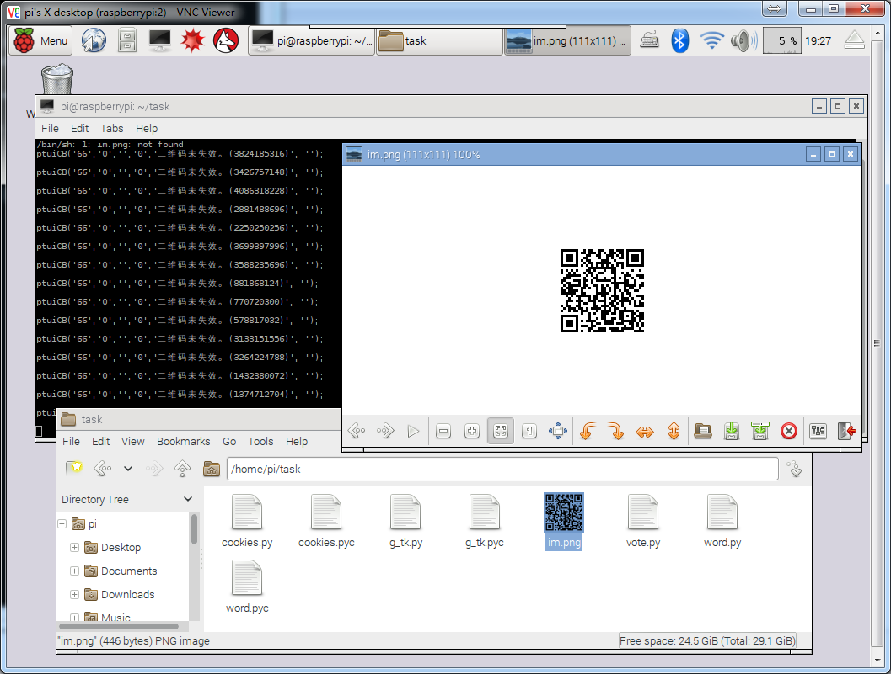
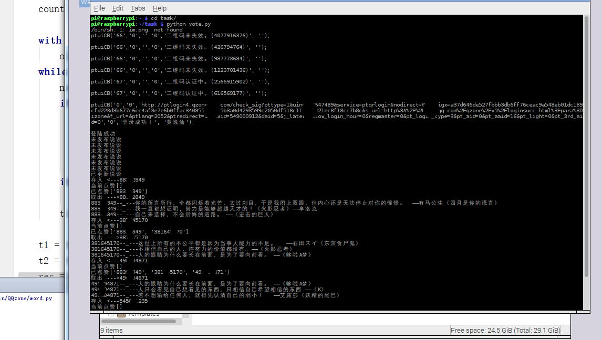

#QQ获取点赞，自动留言

##一、相关内容
### 1.文件目录

`cookies.py` 登陆成功保存的cookies方便留言使用

`g_tk.py` 根据登陆成功的cookies生成相关的验证g_tk

`vote.py` 主模块(获取点赞+留言)

`word.py` 留言集

`id.py` 最新发布的说说id

`addMsg.py` 单独提取出来的留言方法，可以给基友刷留言

`im.png` 二维码图片

### 2.使用方法
发布说说，运行vote.py，扫描登陆QQ，坐等点赞。

##二、具体效果
- 启动脚本

- 获取最新说说及点赞

- 根据点赞QQ进行留言

- 留言情况

## 三、备注
###- 2017年1月9日验证可用
###- web端QQ空间协议
###- 留言过多会被限制留言
